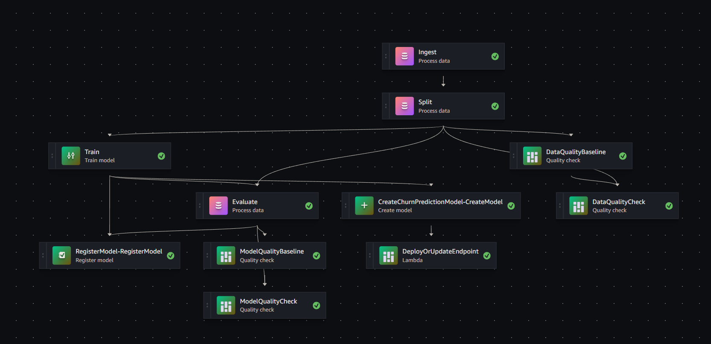

# Churn Prediction SageMaker MLOps

AWS SageMaker MLOps pipeline that automatically triggers on dataset upload to S3 data directory bucket `/dev/raw`.
The pipeline process is fully automated, from the first step, ingesting the data all the way to the last step, deploying the model with an endpoint.

## Pipeline steps

Inside the pipeline, these are the following steps in chronogical order of execution.

**Ingest**: Data file gets read and checked for:
* Invalid values and NA's in columns.
* Unexpected columns.

After validation passes, data gets cleaned:
* Whitespace removal.
* Clean up floats.
* Binary encode 'Yes', 'No' columns with 1, 0 respectively.
* One-hot encode categorical columns.

**Split Features**: Cleaned and validated data gets split into train (70%), validation (15%) and test (15%) sets.

**Training**: Train the model using XGBoost.

**Evaluate**: The trained model gets evaluated on the following metrics:

* `roc_auc`: Measurement of model's ability to seperate Positives from Negatives.
* `pr_auc`: Correctly identified Positives.
* `logloss`: Predicted vs True label accuracy.
* `f1`: Harmonic mean between precision and recall.
* `precision`: Among predicted Positives, how many actually True Positive.
* `recall`: Among all Positives, how many predicted as True Positives.
* `positive_rate`: Percentage of predicted Positives.

**Register**: The model gets registered to SageMaker with a custom status of '`Approved`'.

**DataQuality Baseline**: DQ Baseline gets generated.

**ModelQuality Baseline**: MQ Baseline gets generated.

**DataQuality Check**: Compare against DQ statistics and constraints and generate report.

**ModelQuality Check**: Compare against MQ statistics andnstraints and generate report.

**Deploy**: Deploy the model and create/update an endpoint, making it accessible via API.

## Technologies

* AWS SageMaker; Pipelines, Processing, Training, Model Registry, Endpoints
* AWS Lambda; Pipeline trigger, deploy endpoint
* AWS EventBridge; S3 upload trigger
* S3; Storage of raw data, split features, model artifacts, metrics...
* GitHub Actions; CI linting with Black and Ruff
* XGBoost
* Python